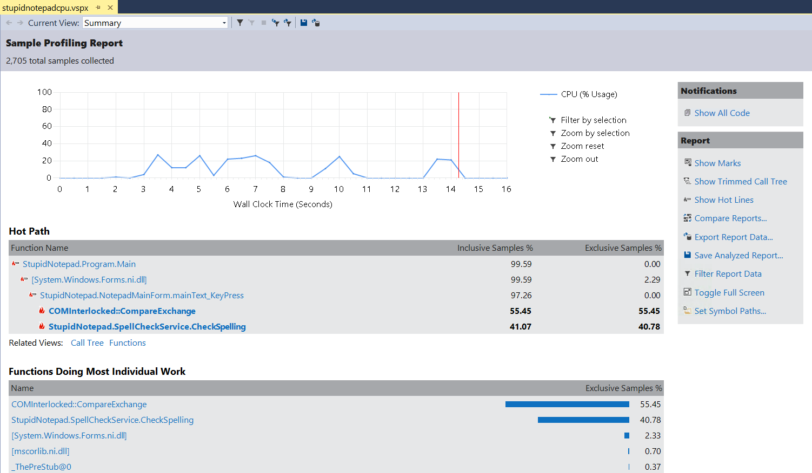

### Profiling CPU Work by Sampling with VSPerfCmd

In this lab you will analyze the CPU utilization of a poorly performing application using the Visual Studio command-line profiling tools.

#### Task 1

If your lab system does not have Visual Studio installed, install the Visual Studio Standalone Profiler. On the Visual Studio installation media (typically an .iso file), locate the Standalone directory and run the installer. In the [tools](../tools) folder you can find the installers for Visual Studio 2015 Update 2.

If your lab system has Visual Studio installed, you will be able to find the command-line profiling tools in the Visual Studio directory under Program Files. For example, for a default installation of Visual Studio 2015, they will be in the following location: `C:\Program Files (x86)\Microsoft Visual Studio 14.0\Team Tools\Performance Tools`.

#### Task 2

Run the StupidNotepad.exe application from the [bin](../perf-perfview-cpu/bin/) directory and start typing some text into the edit box. You'll notice that the UI occasionally stutters and stops responding for short periods of time. If you open a Task Manager window and inspect the CPU utilization at the same time, you will also notice CPU usage spikes when typing into the application.

> The following instructions for using the Visual Studio command-line profiling tools depend on your Windows version. Windows 8 and Windows Server 2012 introduced kernel changes which forced the profiling tools architecture to change as well, and use ETW instead of a kernel sampling driver. Based on your Windows version, follow the instructions in the appropriate section below.

##### On Windows 8 or Windows Server 2012 and Later

Open a command prompt window and navigate to the directory that contains the Visual Studio command-line profiling tools. Then, run the following command to attach to the StupidNotepad.exe application and start CPU sampling:

```
VSPerf /attach:StupidNotepad.exe /file:C:\Temp\StupidNotepadCPU.vspx
```

##### On Windows 7 or Windows Server 2008 and Earlier

Open a command prompt window and navigate to the directory that contains the Visual Studio command-line profiling tools. Then, run the following command to set environment variables necessary for CPU profiling of .NET applications:

```
VSPerfCLREnv /sampleon
```

Next, start a sampling session by running the following command:

```
VSPerfCmd /start:sample /output:C:\Temp\StupidNotepadCPU.vsp
```

Finally, attach the profiler to the StupidNotepad.exe application by running the following command:

```
VSPerfCmd /attach:StupidNotepad.exe
```

Type some text into the edit box again, and make sure the UI hiccup occurs multiple times. When you think you have enough information to start analyzing the problem, run the following commands to detach from the target application and shut down the profiler:

```
VSPerfCmd /detach
VSPerfCmd /shutdown
```

#### Task 3

Regardless of your operating system version, the end result of the CPU sampling session is a Visual Studio Profiler Report (.vsp or .vspx) file. If your lab system does not have Visual Studio installed, copy the report file to a system that has Visual Studio installed, and then open it in Visual Studio using **File** > **Open File**. 



After the report opens, identify the functions that consumed most of the CPU time. Try to determine what the hottest path through the application is. You should now be able to conclude that the `NotepadMainForm.mainText_KeyPress` event handler seems to be spending a lot of CPU time in spell-checking related methods, which shouldn't be happening on the UI thread.

To get even more information, you might want to inspect the function sources while analyzing in the profiler report -- just click a function to navigate to a detail view. However, you will need to tell Visual Studio where to find the symbol (.pdb) files for the StupidNotepad executable, and where to find the corresponding sources. These are in the [bin](../perf-perfview-cpu/bin/) and [src](../perf-perfview-cpu/src/) directories.
